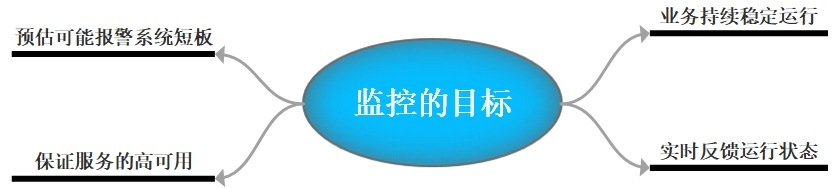

### 什么是监控
我们先来了解什么是监控，监控的重要性以及监控的目标，当然每个人所在的行业不同、公司不同、业务不同、岗位不同、对监控的理解也不同，但是我们需要注意，监控是需要站在公司的业务角度去考虑，而不是针对某个监控技术的使用

##### 监控的含义
从技术角度来看，监控是衡量和管理技术系统的工具和流程。  
**但**监控远远不止于此，监控能够将获得的Metrics（监控指标）转为一条条商业数据，分析并预测商业系统的健康状态，及时调整商业策略，从而获得商业价值  
实际上，监控系统可以分为以下两个层面：
 - 一种是以技术角度出发：  
 从技术角度出发，这是我们自己以及从事管理维护的同事（可能被叫做运维工程师、DevOps或是SRE）所要面对的。我们可以在业务系统出现问题之前，发现出现的系统瓶颈。如CPU负载过高、磁盘IO过高等。  
 监控提供了大量的数据，帮助我们对当前系统的健康状态做出判断。监控也是管理项目生命周期的基础，能够量化的评估出该项目的价值
如果没有监控，那么好的情况是系统么有出现故障，坏的情况就是发生了故障问题没有被发现！

 - 另一种是以业务为导向：  
 业务是监控系统的另一种存在的意义，监控系统是为了支撑业务，并保证业务的高可用。  
 监控系统也能出具一份商业报告，来评估商业系统的优劣，以便企业做出调整，进行产品升级和优化！

##### 监控的目标

- 1.业务持续稳定运行:实际上是对系统不间断的实时监控(这就是监控)

- 2.实时反馈系统当前状态:我们监控某个硬件、或者某个系统，都是需要能实时看到当前系统的状态，是正常、异常、或者故障

- 3.保证服务可靠性安全性:我们监控的目的就是要保证系统、服务、业务正常运行

- 4.提前预估出可能出现的系统短板:如果我们的监控做得很完善，就能在系统出现故障以前，就能提前处理掉此次即将出现的告警
